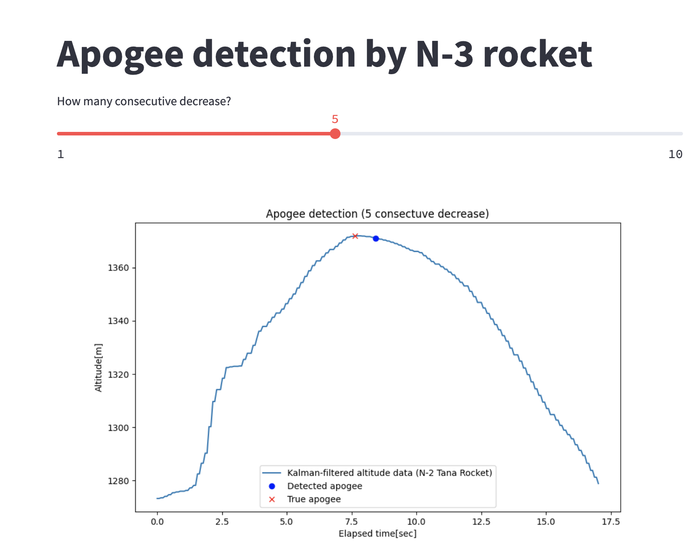

# Apogee detection (N-3 rocket)

(Revised) 
The parachute is ejected when the specific distance is desreased from the local maxima. The parameters is set as 5 m but it could be reduced to even 1 m.

### Obsolete content 

~~It detects the apogee when there is 5 consecutive decrease in the measured altitude sequence.
The below is the simulation made with the measured data of N-2 rocket (Tana).~~

### Kalman filtered data

### Raw data

~~There was another idea to detect the apogee by checking if there is 5 m decrease from the last data. This has a problem to include the outlier data which is typically observed immediately after the launch. Kalman Filter cannot filter this outlier because Kalman gain is not stabilized due to the lack of sampled data.~~

~~To solve the issue, we could consider ignoring the sampled data for a while after the launch. However, it may induce another issue of detecting the launch (i.e., state machine). Therefore, we stick to the first detection logic which uses 5 consecutive decrease.~~
 