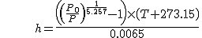

# Apogee detection

## How to run
```
> apogee
```


## Reference
David W. Schultz, Application of the Kalman Filter to Rocket Apogee Detection

[https://forum.arduino.cc/index.php?action=dlattach;topic=717425.0;attach=392768](https://forum.arduino.cc/index.php?action=dlattach;topic=717425.0;attach=392768)

## Sample data generation

The sample flight log was found on Nakka's website: [https://www.nakka-rocketry.net/A-100M.html](https://www.nakka-rocketry.net/A-100M.html) 

Flight log included time, thrust, altitude, velocity, acceleration, mass, dynamic pressure, and drag.


Extracted time, altitude, acceleration and converted to SI unit. The data ranges only around apogee. Then, atmospheric pressure was calculated from altitude, using the following formula (Calibration formula for BMP180).



MATLAB polyfit() function was used to interpolate the value. By this, sample data was obtained for the period of 20ms.


The sensor observation value was created by adding Gaussian noise to this reference data.


