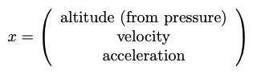
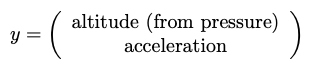
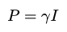

# Apogee detection

## How to run
```
> apogee
```


## Reference
David W. Schultz, Application of the Kalman Filter to Rocket Apogee Detection

[https://forum.arduino.cc/index.php?action=dlattach;topic=717425.0;attach=392768](https://forum.arduino.cc/index.php?action=dlattach;topic=717425.0;attach=392768)

## Main point
The flight of the model rocket around the apogee can be approximated as the uniformly accelerated motion. It is because the thrust is already cut off and only the gravitiy matters. We should consider the drag but it can be ignored since it is tiny. In case we consider the drag, we need to use Extended Kalman Filter (EKF) since the drag is proportinal to the square of the velocity. Note that the Linear Kalman Filter, which I'm using in this code, can be used only for the linear system.

For the uniformly accelerated motion, the system model is described as follows. 







The covariance matrix P is initialized as follows.

 

where gamma is the constant and I is the unit matrix. The value of the gamma was sensitive of the performance of the kalman filter. (I found gamma=100 worked fine.)

## Sample data generation

The sample flight log was found on Nakka's website: [https://www.nakka-rocketry.net/A-100M.html](https://www.nakka-rocketry.net/A-100M.html) 

The flight log included time, thrust, altitude, velocity, acceleration, mass, dynamic pressure, and drag.


I extracted time, altitude, acceleration for the range of apogee area (from about 6sec to 9sec) and converted them to SI unit. Then, the atmospheric pressure was calculated from altitude, using the following formula (Calibration formula for BMP180: [http://www.umek.topaz.ne.jp/mameduino/bmp180_pressuresensor_1/](http://www.umek.topaz.ne.jp/mameduino/bmp180_pressuresensor_1/)).


MATLAB polyfit() function was used to interpolate the value. For example, in the below graph of the interpolation of the altitude, N=2 is selected since it is capable enough to represente the data. (Try fittest.m in the misc folder to see.)


Finally, sample data were obtained for the period of 20ms.


The sensor observation value was created by adding Gaussian noise to this reference data.


